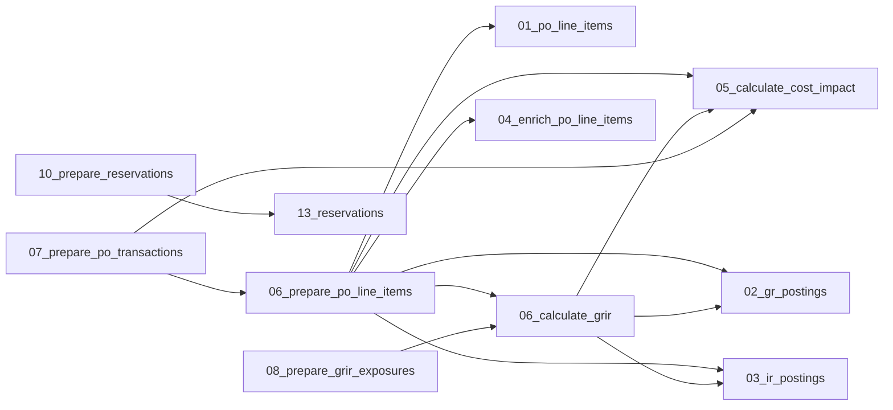

# Pipeline Map

Generated: 2026-02-18T03:47:17.351867+00:00

## Data Flow Diagram

```mermaid
flowchart TD
    subgraph RAW["Raw Data"]
        raw_0["po details report.xlsx"]
        raw_1["invoice table.csv"]
        raw_2["po line items.csv"]
        raw_3["gr table.csv"]
    end

    subgraph STAGE1["Stage 1: Clean"]
        01_po_line_items["01_po_line_items"]
        02_gr_postings["02_gr_postings"]
        03_ir_postings["03_ir_postings"]
        10_wbs_from_projects["10_wbs_from_projects"]
        11_wbs_from_operations["11_wbs_from_operations"]
        12_wbs_from_ops_activities["12_wbs_from_ops_activities"]
        13_reservations["13_reservations"]
    end

    subgraph INTERMEDIATE["Intermediate Data"]
        int_0["gr_postings.csv"]
        int_1["reservations.csv"]
        int_2["unmatched_reservation_pos.csv"]
        int_3["grir_exposures.csv"]
        int_4["wbs_from_operations.csv"]
        int_5["ir_postings.csv"]
        int_6["wbs_from_projects.csv"]
        int_7["po_details_enrichment.csv"]
        int_8["wbs_from_ops_activities.csv"]
        int_9["cost_impact.csv"]
        int_10["wbs_processed.csv"]
        int_11["po_line_items.csv"]
    end

    subgraph STAGE2["Stage 2: Transform"]
        04_enrich_po_line_items["04_enrich_po_line_items"]
        05_calculate_cost_impact["05_calculate_cost_impact"]
        06_calculate_grir["06_calculate_grir"]
        07_process_wbs["07_process_wbs"]
    end

    subgraph STAGE3["Stage 3: Prepare"]
        06_prepare_po_line_items["06_prepare_po_line_items"]
        07_prepare_po_transactions["07_prepare_po_transactions"]
        08_prepare_grir_exposures["08_prepare_grir_exposures"]
        09_prepare_wbs_details["09_prepare_wbs_details"]
        10_prepare_reservations["10_prepare_reservations"]
    end

    subgraph IMPORTREADY["Import-Ready Data"]
        ready_0["po_transactions.csv"]
        ready_1["grir_exposures.csv"]
        ready_2["wbs_details.csv"]
        ready_3["sap_reservations.csv"]
        ready_4["po_line_items.csv"]
    end

    subgraph DB["Database Tables"]
        db_agent_memories[("agent_memories")]
        db_agent_memory_history[("agent_memory_history")]
        db_budget_forecasts[("budget_forecasts")]
        db_business_units[("business_units")]
        db_business_unit_rules[("business_unit_rules")]
        db_cost_breakdown[("cost_breakdown")]
        db_forecast_versions[("forecast_versions")]
        db_grir_exposures[("grir_exposures")]
        db_pending_invites[("pending_invites")]
        db_po_date_overrides[("po_date_overrides")]
        db_po_line_items[("po_line_items")]
        db_po_mappings[("po_mappings")]
        db_po_operations[("po_operations")]
        db_po_transactions[("po_transactions")]
        db_pr_pre_mappings[("pr_pre_mappings")]
        db_projects[("projects")]
        db_registration_attempts[("registration_attempts")]
        db_registration_audit_log[("registration_audit_log")]
        db_sap_reservations[("sap_reservations")]
        db_users[("users")]
        db_wbs_details[("wbs_details")]
        db_webauthn_challenges[("webauthn_challenges")]
        db_webauthn_credentials[("webauthn_credentials")]
    end

    %% Data Flow Connections
    RAW --> STAGE1
    STAGE1 --> INTERMEDIATE
    INTERMEDIATE --> STAGE2
    STAGE2 --> INTERMEDIATE
    INTERMEDIATE --> STAGE3
    STAGE3 --> IMPORTREADY
    IMPORTREADY --> DB
```

## Script Details

| # | Script | Stage | Purpose | Inputs | Outputs |
|---|--------|-------|---------|--------|---------|
| 1 | `01_po_line_items` | stage1_clean | Stage 1: Clean PO Line Items | po line items.csv, po_line_items.csv | po_line_items.csv |
| 2 | `02_gr_postings` | stage1_clean | Stage 1: Clean GR (Goods Receipt) Postings | gr table.csv, po_line_items.csv, gr_postings.csv | po_line_items.csv, gr_postings.csv |
| 3 | `03_ir_postings` | stage1_clean | Stage 1: Clean IR (Invoice Receipt) Postings | invoice table.csv, po_line_items.csv, ir_postings.csv | po_line_items.csv, ir_postings.csv |
| 4 | `10_wbs_from_projects` | stage1_clean | Stage 1: Extract WBS Data from Projects Report | fdp, wbs_from_projects.csv | wbs_from_projects.csv |
| 5 | `11_wbs_from_operations` | stage1_clean | Stage 1: Extract WBS Data from Operations Report | fdp, wbs_from_operations.csv | wbs_from_operations.csv |
| 6 | `12_wbs_from_ops_activities` | stage1_clean | Stage 1: Extract WBS Data from Operation Activitie | fdp, wbs_from_ops_activities.csv | wbs_from_ops_activities.csv |
| 7 | `13_reservations` | stage1_clean | Stage 1: Clean Reservations | reservations, reservations.csv | reservations.csv |
| 8 | `04_enrich_po_line_items` | stage2_transform | Stage 2: Enrich PO Line Items | po details report.xlsx, po_line_items.csv, po_details_enrichment.csv | po_line_items.csv, po_details_enrichment.csv |
| 9 | `05_calculate_cost_impact` | stage2_transform | Stage 2: Calculate Cost Impact | po_line_items.csv, gr_postings.csv, ir_postings.csv, cost_impact.csv | po_line_items.csv, gr_postings.csv, ir_postings.csv, cost_impact.csv |
| 10 | `06_calculate_grir` | stage2_transform | Stage 2: Calculate GRIR Exposures | po_line_items.csv, gr_postings.csv, ir_postings.csv, grir_exposures.csv | po_line_items.csv, gr_postings.csv, ir_postings.csv, grir_exposures.csv |
| 11 | `07_process_wbs` | stage2_transform | Stage 2: Process WBS Data - Split, Parse, and Map  | - | - |
| 12 | `06_prepare_po_line_items` | stage3_prepare | Stage 3: Prepare PO Line Items for Import | po_line_items.csv, cost_impact.csv | po_line_items.csv, cost_impact.csv |
| 13 | `07_prepare_po_transactions` | stage3_prepare | Stage 3: Prepare PO Transactions for Import | cost_impact.csv | cost_impact.csv |
| 14 | `08_prepare_grir_exposures` | stage3_prepare | Stage 3: Prepare GRIR Exposures for Import | grir_exposures.csv | grir_exposures.csv |
| 15 | `09_prepare_wbs_details` | stage3_prepare | Stage 3: Prepare WBS Details for Import | wbs_processed.csv | wbs_processed.csv |
| 16 | `10_prepare_reservations` | stage3_prepare | Stage 3: Prepare SAP Reservations for Import | reservations.csv | reservations.csv |
| 17 | `pipeline` | scripts | Data Pipeline Orchestrator | - | - |

## Script Dependencies

## Column Mappings

### PO Line Items (CSV → DB)

| CSV Column | DB Column |
|------------|-----------|
| PO Line ID | `po_line_id` |
| PO Number | `po_number` |
| PO Document Date | `po_creation_date` |
| Plant Code | `plant_code` |
| Location | `location` |
| SL Sub-Business Line Code (BV Lvl 3) | `sub_business_line` |
| PR Number | `pr_number` |
| PR Line | `pr_line` |
| Requester | `requester` |
| Main Vendor ID | `vendor_id` |

*...and 20 more*

## Database Schema

### `agent_memories`

| Column | Type | Constraints |
|--------|------|-------------|
| `id` | uuid | PK |
| `userId` | uuid | NOT NULL, FK → users.id |
| `content` | text | NOT NULL |
| `memoryType` | varchar | NOT NULL, DEFAULT |
| `entities` | jsonb | DEFAULT |
| `keywords` | jsonb | DEFAULT |
| `metadata` | jsonb | DEFAULT |
| `importance` | real | NOT NULL, DEFAULT |
| `accessCount` | integer | NOT NULL, DEFAULT |
| `lastAccessedAt` | timestamp | - |
| `contentHash` | varchar | - |
| `embedding` | unknown | - |
| `event` | varchar | DEFAULT |
| `previousVersionId` | uuid | - |
| `createdAt` | timestamp | - |
| *...* | *1 more* | |

### `agent_memory_history`

| Column | Type | Constraints |
|--------|------|-------------|
| `id` | uuid | PK |
| `memoryId` | uuid | NOT NULL, FK → agentMemories.id |
| `oldContent` | text | - |
| `newContent` | text | - |
| `event` | varchar | NOT NULL |
| `reason` | text | - |
| `createdAt` | timestamp | - |

### `budget_forecasts`

| Column | Type | Constraints |
|--------|------|-------------|
| `id` | uuid | PK |
| `forecastVersionId` | uuid | NOT NULL, FK → forecastVersions.id |
| `costBreakdownId` | uuid | NOT NULL, FK → costBreakdown.id |
| `forecastedCost` | numeric | NOT NULL, DEFAULT |
| `createdAt` | timestamp | - |

### `business_units`

| Column | Type | Constraints |
|--------|------|-------------|
| `id` | serial | PK |
| `key` | varchar | NOT NULL |
| `label` | varchar | NOT NULL |
| `sortOrder` | integer | NOT NULL, DEFAULT |

### `business_unit_rules`

| Column | Type | Constraints |
|--------|------|-------------|
| `id` | serial | PK |
| `businessUnitKey` | varchar | NOT NULL |
| `subBusinessLine` | varchar | NOT NULL |
| `location` | varchar | - |

### `cost_breakdown`

| Column | Type | Constraints |
|--------|------|-------------|
| `id` | uuid | PK |
| `projectId` | uuid | NOT NULL, FK → projects.id |
| `costLine` | text | NOT NULL |
| `spendType` | text | NOT NULL |
| `spendSubCategory` | text | NOT NULL |
| `budgetCost` | numeric | NOT NULL, DEFAULT |
| `createdAt` | timestamp | - |
| `updatedAt` | timestamp | - |

### `forecast_versions`

| Column | Type | Constraints |
|--------|------|-------------|
| `id` | uuid | PK |
| `projectId` | uuid | NOT NULL, FK → projects.id |
| `versionNumber` | integer | NOT NULL |
| `reasonForChange` | text | NOT NULL |
| `createdAt` | timestamp | - |
| `createdBy` | text | DEFAULT |

### `grir_exposures`

| Column | Type | Constraints |
|--------|------|-------------|
| `id` | uuid | PK |
| `poLineItemId` | uuid | NOT NULL, FK → poLineItems.id |
| `grirQty` | numeric | NOT NULL, DEFAULT |
| `grirValue` | numeric | NOT NULL, DEFAULT |
| `firstExposureDate` | date | - |
| `daysOpen` | integer | DEFAULT |
| `timeBucket` | varchar | - |
| `snapshotDate` | date | NOT NULL |
| `createdAt` | timestamp | - |
| `updatedAt` | timestamp | - |

### `pending_invites`

| Column | Type | Constraints |
|--------|------|-------------|
| `id` | uuid | PK |
| `email` | varchar | NOT NULL |
| `pinHash` | varchar | NOT NULL |
| `createdBy` | uuid | FK → users.id |
| `expiresAt` | timestamp | NOT NULL |
| `used` | boolean | DEFAULT |
| `usedAt` | timestamp | - |
| `failedAttempts` | integer | NOT NULL, DEFAULT |
| `createdAt` | timestamp | - |

### `po_date_overrides`

| Column | Type | Constraints |
|--------|------|-------------|
| `id` | uuid | PK |
| `poLineItemId` | uuid | NOT NULL, FK → poLineItems.id |
| `originalDate` | date | NOT NULL |
| `overrideDate` | date | NOT NULL |
| `reason` | text | NOT NULL |
| `overrideBy` | varchar | NOT NULL |
| `overrideAt` | timestamp | NOT NULL |
| `isActive` | boolean | NOT NULL, DEFAULT |
| `createdAt` | timestamp | - |
| `updatedAt` | timestamp | - |

### `po_line_items`

| Column | Type | Constraints |
|--------|------|-------------|
| `id` | uuid | PK |
| `poLineId` | varchar | NOT NULL |
| `poNumber` | varchar | NOT NULL |
| `poCreationDate` | date | - |
| `plantCode` | varchar | - |
| `location` | varchar | - |
| `subBusinessLine` | varchar | - |
| `prNumber` | varchar | - |
| `prLine` | integer | - |
| `requester` | varchar | - |
| `vendorId` | varchar | - |
| `vendorName` | varchar | - |
| `vendorCategory` | varchar | - |
| `ultimateVendorName` | varchar | - |
| `lineItemNumber` | integer | NOT NULL |
| *...* | *27 more* | |

### `po_mappings`

| Column | Type | Constraints |
|--------|------|-------------|
| `id` | uuid | PK |
| `poLineItemId` | uuid | NOT NULL, FK → poLineItems.id |
| `costBreakdownId` | uuid | NOT NULL, FK → costBreakdown.id |
| `mappedAmount` | numeric | NOT NULL |
| `mappingNotes` | text | - |
| `mappedBy` | varchar | - |
| `mappedAt` | timestamp | - |
| `createdAt` | timestamp | - |
| `updatedAt` | timestamp | - |
| `mappingSource` | varchar | NOT NULL, DEFAULT |
| `sourcePrPreMappingId` | uuid | FK → prPreMappings.id |
| `requiresConfirmation` | boolean | NOT NULL, DEFAULT |
| `confirmedAt` | timestamp | - |
| `confirmedBy` | varchar | - |

### `po_operations`

| Column | Type | Constraints |
|--------|------|-------------|
| `id` | uuid | PK |
| `poLineItemId` | uuid | NOT NULL, FK → poLineItems.id |
| `operationType` | varchar | NOT NULL |
| `status` | varchar | NOT NULL, DEFAULT |
| `requestedBy` | varchar | NOT NULL |
| `requestedAt` | timestamp | NOT NULL |
| `approvedBy` | varchar | - |
| `approvedAt` | timestamp | - |
| `completedAt` | timestamp | - |
| `reason` | text | NOT NULL |
| `oldValue` | jsonb | - |
| `newValue` | jsonb | - |
| `notes` | text | - |
| `createdAt` | timestamp | - |
| `updatedAt` | timestamp | - |

### `po_transactions`

| Column | Type | Constraints |
|--------|------|-------------|
| `id` | uuid | PK |
| `transactionId` | varchar | NOT NULL |
| `poLineItemId` | uuid | NOT NULL, FK → poLineItems.id |
| `transactionType` | varchar | NOT NULL |
| `postingDate` | date | NOT NULL |
| `quantity` | numeric | NOT NULL, DEFAULT |
| `amount` | numeric | NOT NULL, DEFAULT |
| `costImpactQty` | numeric | NOT NULL, DEFAULT |
| `costImpactAmount` | numeric | NOT NULL, DEFAULT |
| `createdAt` | timestamp | - |
| `updatedAt` | timestamp | - |

### `pr_pre_mappings`

| Column | Type | Constraints |
|--------|------|-------------|
| `id` | uuid | PK |
| `prNumber` | varchar | NOT NULL |
| `prLine` | integer | - |
| `costBreakdownId` | uuid | NOT NULL, FK → costBreakdown.id |
| `status` | varchar | NOT NULL, DEFAULT |
| `pendingConfirmationCount` | integer | NOT NULL, DEFAULT |
| `confirmedCount` | integer | NOT NULL, DEFAULT |
| `closedAt` | timestamp | - |
| `closedBy` | varchar | - |
| `notes` | text | - |
| `createdBy` | varchar | - |
| `expiresAt` | timestamp | NOT NULL |
| `createdAt` | timestamp | - |
| `updatedAt` | timestamp | - |

### `projects`

| Column | Type | Constraints |
|--------|------|-------------|
| `id` | uuid | PK |
| `name` | text | NOT NULL |
| `subBusinessLine` | text | NOT NULL |
| `createdAt` | timestamp | - |
| `updatedAt` | timestamp | - |

### `registration_attempts`

| Column | Type | Constraints |
|--------|------|-------------|
| `tokenHash` | unknown | PK |
| `email` | varchar | NOT NULL |
| `expiresAt` | timestamp | NOT NULL |
| `used` | boolean | DEFAULT |
| `createdAt` | timestamp | - |
| `deviceBindingChallenge` | varchar | - |
| `deviceCredentialId` | text | - |
| `devicePublicKey` | text | - |
| `deviceBindingVerified` | boolean | DEFAULT |

### `registration_audit_log`

| Column | Type | Constraints |
|--------|------|-------------|
| `id` | uuid | PK |
| `email` | varchar | NOT NULL |
| `attemptType` | varchar | NOT NULL |
| `ipHash` | unknown | - |
| `userAgent` | varchar | - |
| `additionalInfo` | jsonb | - |
| `createdAt` | timestamp | - |

### `sap_reservations`

| Column | Type | Constraints |
|--------|------|-------------|
| `id` | uuid | PK |
| `reservationLineId` | varchar | NOT NULL |
| `reservationNumber` | varchar | NOT NULL |
| `reservationLineNumber` | integer | NOT NULL |
| `reservationRequirementDate` | date | - |
| `reservationCreationDate` | date | - |
| `partNumber` | varchar | - |
| `description` | text | - |
| `openReservationQty` | numeric | - |
| `openReservationValue` | numeric | - |
| `reservationStatus` | varchar | - |
| `reservationSource` | varchar | - |
| `poNumber` | varchar | - |
| `poLineNumber` | integer | - |
| `wbsNumber` | varchar | - |
| *...* | *7 more* | |

### `users`

| Column | Type | Constraints |
|--------|------|-------------|
| `id` | uuid | PK |
| `email` | varchar | NOT NULL |
| `totpSecret` | varchar | - |
| `backupCodes` | text | - |
| `isActive` | boolean | DEFAULT |
| `createdAt` | timestamp | - |
| `lastLoginAt` | timestamp | - |

### `wbs_details`

| Column | Type | Constraints |
|--------|------|-------------|
| `wbsNumber` | varchar | PK |
| `wbsSource` | varchar | NOT NULL |
| `projectNumber` | varchar | - |
| `operationNumber` | varchar | - |
| `opsActivityNumber` | varchar | - |
| `wbsName` | text | - |
| `clientName` | text | - |
| `rig` | varchar | - |
| `opsDistrict` | varchar | - |
| `location` | varchar | - |
| `subBusinessLines` | text | - |
| `createdAt` | timestamp | - |
| `updatedAt` | timestamp | - |

### `webauthn_challenges`

| Column | Type | Constraints |
|--------|------|-------------|
| `challenge` | text | PK |
| `userId` | text | - |
| `email` | varchar | NOT NULL |
| `type` | varchar | NOT NULL |
| `expiresAt` | timestamp | NOT NULL |
| `createdAt` | timestamp | - |

### `webauthn_credentials`

| Column | Type | Constraints |
|--------|------|-------------|
| `id` | uuid | PK |
| `userId` | uuid | NOT NULL, FK → users.id |
| `credentialId` | text | NOT NULL |
| `publicKey` | text | NOT NULL |
| `counter` | bigint | NOT NULL, DEFAULT |
| `transports` | text | - |
| `deviceType` | varchar | - |
| `backedUp` | boolean | DEFAULT |
| `deviceName` | varchar | - |
| `createdAt` | timestamp | - |
| `lastUsedAt` | timestamp | - |

## Data Profiles

Sample data and types for each CSV file:

### `invoice table.csv`

- **Path**: `data/raw/invoice table.csv`
- **Rows**: 66616

| Column | Type |
|--------|------|
| `PO Line ID` | object |
| `Invoice Posting Date` | object |
| `IR Effective Quantity` | float64 |

### `po line items.csv`

- **Path**: `data/raw/po line items.csv`
- **Rows**: 63298

| Column | Type |
|--------|------|
| `PO Document Date` | object |
| `PO Initial Output Date` | object |
| `SL Sub-Business Line Code (BV Lvl 3)` | object |
| `Plant Code` | int64 |
| `PO Approval Status` | object |
| `PO Account Assignment Category` | object |
| `PO Account Assignment Category Desc` | object |
| `PO WBS Element` | object |
| `PO Number` | int64 |
| `PO Line` | int64 |
| *...* | *21 more* |

**Columns with nulls:**
- `PO Initial Output Date`: 227 nulls
- `PO Account Assignment Category`: 10659 nulls
- `PO Account Assignment Category Desc`: 10659 nulls
- `PO WBS Element`: 38174 nulls
- `PO Material Number`: 49230 nulls
- `PO Valuation Class`: 49230 nulls
- `PO Valuation Class Desc`: 49230 nulls
- `NIS Level 0 Desc`: 12269 nulls
- `PO GTS Status`: 110 nulls
- `PO Current Supplier Promised Date`: 33304 nulls

### `gr table.csv`

- **Path**: `data/raw/gr table.csv`
- **Rows**: 78520

| Column | Type |
|--------|------|
| `PO Line ID` | object |
| `GR Posting Date` | object |
| `GR Effective Quantity` | float64 |

### `gr_postings.csv`

- **Path**: `data/intermediate/gr_postings.csv`
- **Rows**: 54401

| Column | Type |
|--------|------|
| `PO Line ID` | object |
| `GR Posting Date` | object |
| `GR Effective Quantity` | float64 |
| `GR Amount` | float64 |

### `reservations.csv`

- **Path**: `data/intermediate/reservations.csv`
- **Rows**: 1685

| Column | Type |
|--------|------|
| `Index` | object |
| `Material-Plant` | object |
| `Plant` | float64 |
| `Geo-Unit` | object |
| `GEO UNIT (Profit Center)` | object |
| `Material` | object |
| `Reservation -Line` | object |
| `Requirements Date` | object |
| `Creation Date` | object |
| `Stock On Hand - DDSC` | float64 |
| *...* | *50 more* |

**Columns with nulls:**
- `Index`: 1 nulls
- `Material-Plant`: 2 nulls
- `Plant`: 2 nulls
- `Geo-Unit`: 2 nulls
- `GEO UNIT (Profit Center)`: 2 nulls
- `Material`: 2 nulls
- `Reservation -Line`: 2 nulls
- `Requirements Date`: 2 nulls
- `Creation Date`: 2 nulls
- `Stock On Hand - DDSC`: 832 nulls
- `Stock On Hand - HDSC`: 973 nulls
- `Last 3 Month Consumption`: 2 nulls
- `Last 6 Month Consumption`: 2 nulls
- `Last 12 Month Consumption`: 2 nulls
- `Material Stratification (Last 6 Month Consumption)`: 2 nulls
- `Material Stratification (Last 12 Month Consumption)`: 2 nulls
- `Open Qty - Reservation`: 2 nulls
- `Open Reservation Value`: 2 nulls
- `Material/Plant-SOH - Total`: 1078 nulls
- `Primary Pegged PO-LN - Open Qty`: 1259 nulls
- `Combined SOH & PO Pegging`: 2 nulls
- `Main - PO Line to Peg to Reservation`: 1177 nulls
- `Main - PO to Peg to Reservation`: 1177 nulls
- `Additional PO - Line to Peg`: 1665 nulls
- `Primary Pegged PO-LN - Order Qty`: 1259 nulls
- `Primary Pegged PO-LN - Approval Status`: 1259 nulls
- `Primary Pegged PO-LN - RDD Date`: 1259 nulls
- `Pegged Main PO GR Status`: 1177 nulls
- `Pegged Main PO Invoice Status`: 1177 nulls
- `Primary Pegged PO-LN - Invoice Qty`: 1578 nulls
- `Post Pegging SOH Qty`: 2 nulls
- `Post Pegging PO Qty`: 45 nulls
- `Material Description`: 2 nulls
- `MRP Parameters - MRP Controller`: 2 nulls
- `MRP Parameters - Profit Center`: 2 nulls
- `MRP Parameters - Planned Delivery Time`: 2 nulls
- `MRP Parameters - Prime Status`: 2 nulls
- `MRP Parameters - Safety Stock`: 2 nulls
- `MRP Parameters - Standard Price`: 2 nulls
- `Business Line - By Cost Center`: 308 nulls
- `Sub - Business Line - By Cost Center`: 308 nulls
- `Business Line by Profit Center`: 2 nulls
- `Material/Plant-Open PO Qty - Total`: 2 nulls
- `Purchase Requisition - Status`: 2 nulls
- `Purchase Requisitions`: 1685 nulls
- `Planned Order - Status`: 2 nulls
- `Planned Orders`: 1234 nulls
- `Maximo Asset ID`: 1163 nulls
- `Maximo Asset Num`: 1163 nulls
- `Maximo Serial No`: 1163 nulls
- `Reservation Creation type`: 2 nulls
- `WO Number`: 604 nulls
- `User Name`: 2 nulls
- `Goods recipient`: 10 nulls
- `Maximo - WO STATUS and Part Status`: 2 nulls
- `WBS Element`: 1379 nulls
- `Cost Center`: 308 nulls
- `reservation_line_id`: 2 nulls
- `reservation_number`: 2 nulls
- `reservation_line_number`: 2 nulls

### `unmatched_reservation_pos.csv`

- **Path**: `data/intermediate/unmatched_reservation_pos.csv`
- **Rows**: 30

| Column | Type |
|--------|------|
| `reservation_line_id` | object |
| `reservation_number` | int64 |
| `reservation_line_number` | int64 |
| `reservation_creation_date` | object |
| `reservation_requirement_date` | object |
| `part_number` | object |
| `description` | object |
| `open_reservation_qty` | float64 |
| `open_reservation_value` | float64 |
| `reservation_status` | object |
| *...* | *9 more* |

**Columns with nulls:**
- `wbs_number`: 19 nulls
- `asset_code`: 28 nulls
- `asset_serial_number`: 28 nulls

### `grir_exposures.csv`

- **Path**: `data/import-ready/grir_exposures.csv`
- **Rows**: 79

| Column | Type |
|--------|------|
| `po_line_id` | object |
| `grir_qty` | float64 |
| `grir_value` | float64 |
| `first_exposure_date` | object |
| `days_open` | int64 |
| `time_bucket` | object |
| `snapshot_date` | object |

### `wbs_from_operations.csv`

- **Path**: `data/intermediate/wbs_from_operations.csv`
- **Rows**: 145

| Column | Type |
|--------|------|
| `sap_wbs_raw` | object |
| `wbs_source` | object |
| `project_number` | object |
| `operation_number` | object |
| `ops_activity_number` | float64 |
| `wbs_name` | object |
| `client_name` | object |
| `rig` | object |
| `ops_district` | object |
| `location` | float64 |
| *...* | *1 more* |

**Columns with nulls:**
- `ops_activity_number`: 145 nulls
- `rig`: 10 nulls
- `location`: 145 nulls

### `ir_postings.csv`

- **Path**: `data/intermediate/ir_postings.csv`
- **Rows**: 54560

| Column | Type |
|--------|------|
| `PO Line ID` | object |
| `Invoice Posting Date` | object |
| `IR Effective Quantity` | float64 |
| `Invoice Amount` | float64 |

### `wbs_from_projects.csv`

- **Path**: `data/intermediate/wbs_from_projects.csv`
- **Rows**: 373

| Column | Type |
|--------|------|
| `sap_wbs_raw` | object |
| `wbs_source` | object |
| `project_number` | object |
| `operation_number` | float64 |
| `ops_activity_number` | float64 |
| `wbs_name` | object |
| `client_name` | object |
| `rig` | object |
| `ops_district` | object |
| `location` | object |

**Columns with nulls:**
- `operation_number`: 373 nulls
- `ops_activity_number`: 373 nulls

### `po_details_enrichment.csv`

- **Path**: `data/intermediate/po_details_enrichment.csv`
- **Rows**: 21809

| Column | Type |
|--------|------|
| `PO Line ID` | object |
| `Requester` | object |
| `PR Number` | object |
| `PR Line` | float64 |

**Columns with nulls:**
- `Requester`: 2501 nulls
- `PR Number`: 366 nulls
- `PR Line`: 2 nulls

### `wbs_from_ops_activities.csv`

- **Path**: `data/intermediate/wbs_from_ops_activities.csv`
- **Rows**: 7211

| Column | Type |
|--------|------|
| `sap_wbs_raw` | object |
| `wbs_source` | object |
| `project_number` | object |
| `operation_number` | object |
| `ops_activity_number` | object |
| `wbs_name` | object |
| `client_name` | object |
| `rig` | object |
| `ops_district` | object |
| `location` | float64 |
| *...* | *1 more* |

**Columns with nulls:**
- `rig`: 235 nulls
- `location`: 7211 nulls

### `cost_impact.csv`

- **Path**: `data/intermediate/cost_impact.csv`
- **Rows**: 107183

| Column | Type |
|--------|------|
| `PO Line ID` | object |
| `Posting Date` | object |
| `Posting Type` | object |
| `Posting Qty` | float64 |
| `Cost Impact Qty` | float64 |
| `Cost Impact Amount` | float64 |

### `wbs_processed.csv`

- **Path**: `data/intermediate/wbs_processed.csv`
- **Rows**: 7889

| Column | Type |
|--------|------|
| `wbs_number` | object |
| `wbs_source` | object |
| `project_number` | object |
| `operation_number` | object |
| `ops_activity_number` | object |
| `wbs_name` | object |
| `client_name` | object |
| `rig` | object |
| `ops_district` | object |
| `location` | object |
| *...* | *1 more* |

**Columns with nulls:**
- `operation_number`: 533 nulls
- `ops_activity_number`: 678 nulls
- `rig`: 245 nulls

### `po_line_items.csv`

- **Path**: `data/import-ready/po_line_items.csv`
- **Rows**: 56424

| Column | Type |
|--------|------|
| `po_line_id` | object |
| `po_number` | int64 |
| `po_creation_date` | object |
| `plant_code` | int64 |
| `location` | object |
| `sub_business_line` | object |
| `pr_number` | float64 |
| `pr_line` | float64 |
| `requester` | object |
| `vendor_id` | object |
| *...* | *27 more* |

**Columns with nulls:**
- `pr_number`: 37284 nulls
- `pr_line`: 36946 nulls
- `requester`: 36838 nulls
- `part_number`: 47175 nulls
- `account_assignment_category`: 8711 nulls
- `nis_line`: 1 nulls
- `wbs_number`: 31363 nulls
- `po_gts_status`: 62 nulls
- `cost_impact_pct`: 28 nulls

### `po_transactions.csv`

- **Path**: `data/import-ready/po_transactions.csv`
- **Rows**: 107183

| Column | Type |
|--------|------|
| `po_line_id` | object |
| `transaction_type` | object |
| `posting_date` | object |
| `quantity` | float64 |
| `cost_impact_qty` | float64 |
| `cost_impact_amount` | float64 |
| `amount` | float64 |
| `transaction_id` | object |

### `wbs_details.csv`

- **Path**: `data/import-ready/wbs_details.csv`
- **Rows**: 7882

| Column | Type |
|--------|------|
| `wbs_number` | object |
| `wbs_source` | object |
| `project_number` | object |
| `operation_number` | object |
| `ops_activity_number` | object |
| `wbs_name` | object |
| `client_name` | object |
| `rig` | object |
| `ops_district` | object |
| `location` | object |
| *...* | *1 more* |

**Columns with nulls:**
- `operation_number`: 526 nulls
- `ops_activity_number`: 671 nulls
- `rig`: 245 nulls

### `sap_reservations.csv`

- **Path**: `data/import-ready/sap_reservations.csv`
- **Rows**: 1683

| Column | Type |
|--------|------|
| `reservation_line_id` | object |
| `reservation_number` | int64 |
| `reservation_line_number` | int64 |
| `reservation_creation_date` | object |
| `reservation_requirement_date` | object |
| `part_number` | object |
| `description` | object |
| `open_reservation_qty` | float64 |
| `open_reservation_value` | float64 |
| `reservation_status` | object |
| *...* | *9 more* |

**Columns with nulls:**
- `wbs_number`: 1377 nulls
- `requester_alias`: 8 nulls
- `po_number`: 1175 nulls
- `po_line_number`: 1175 nulls
- `po_line_item_id`: 1175 nulls
- `asset_code`: 1161 nulls
- `asset_serial_number`: 1190 nulls

## Common Errors & Solutions

### KeyError

**Causes:**
- Column doesn't exist in DataFrame
- Previous script in pipeline didn't run
- Column name has different casing or spacing

**Solutions:**
- Check column_mappings.py for correct column names
- Run full pipeline: python3 scripts/pipeline.py
- Use df.columns.tolist() to see actual column names

### MergeError

**Causes:**
- Join columns have different dtypes (int vs str)
- One side has NaN values causing type inference issues

**Solutions:**
- Ensure both join columns are same type: df['col'] = df['col'].astype(str)
- Check for nulls before merge: df['col'].isnull().sum()

### FileNotFoundError

**Causes:**
- Previous pipeline stage didn't run
- Raw data files missing

**Solutions:**
- Run earlier stages first: python3 scripts/pipeline.py --stage1
- Check data/raw/ for source files

### ValueError_date

**Causes:**
- Date column has inconsistent formats
- Non-date values in date column

**Solutions:**
- Use pd.to_datetime with errors='coerce'
- Check for non-date values: df[pd.to_datetime(df['col'], errors='coerce').isna()]

### SchemaValidationError

**Causes:**
- Database schema changed but CSV mapping not updated
- Column dropped in earlier transformation

**Solutions:**
- Compare column_mappings.py with src/schema/*.ts
- Run npm run type-check after schema changes

## Transformation Operations

Key pandas operations used in each script:

### `01_po_line_items`

| Line | Operation | Details |
|------|-----------|---------|
| 103 | column_assign | column: `Location` |
| 114 | column_assign | column: `Expected Delivery Date` |
| 81 | rename | Renames columns |
| 89 | map | Maps values using dictionary or function |
| 94 | map | Maps values using dictionary or function |
| 102 | astype | Converts column types |
| 103 | map | Maps values using dictionary or function |
| 120 | drop | Removes columns or rows |
| 129 | sort_values | Sorts by column values |

### `02_gr_postings`

| Line | Operation | Details |
|------|-----------|---------|
| 53 | column_assign | column: `Unit Price` |
| 64 | column_assign | column: `GR Amount` |
| 59 | merge | on: `PO Line ID` |

### `03_ir_postings`

| Line | Operation | Details |
|------|-----------|---------|
| 44 | column_assign | column: `Unit Price` |
| 55 | column_assign | column: `Invoice Amount` |
| 50 | merge | on: `PO Line ID` |

### `10_wbs_from_projects`

| Line | Operation | Details |
|------|-----------|---------|
| 118 | column_assign | column: `location` |
| 134 | column_assign | column: `rig` |
| 149 | column_assign | column: `wbs_source` |
| 150 | column_assign | column: `operation_number` |
| 151 | column_assign | column: `ops_activity_number` |
| 173 | boolean_filter | Filters rows based on boolean condition |
| 111 | rename | Renames columns |
| 118 | map | Maps values using dictionary or function |
| 89 | astype | Converts column types |
| 139 | astype | Converts column types |

### `11_wbs_from_operations`

| Line | Operation | Details |
|------|-----------|---------|
| 118 | column_assign | column: `wbs_source` |
| 119 | column_assign | column: `ops_activity_number` |
| 122 | column_assign | column: `location` |
| 146 | boolean_filter | Filters rows based on boolean condition |
| 111 | rename | Renames columns |
| 89 | astype | Converts column types |

### `12_wbs_from_ops_activities`

| Line | Operation | Details |
|------|-----------|---------|
| 120 | column_assign | column: `wbs_source` |
| 123 | column_assign | column: `location` |
| 147 | boolean_filter | Filters rows based on boolean condition |
| 113 | rename | Renames columns |
| 90 | astype | Converts column types |

### `13_reservations`

| Line | Operation | Details |
|------|-----------|---------|
| 77 | column_assign | column: `reservation_line_id` |
| 90 | column_assign | column: `reservation_number` |
| 93 | column_assign | column: `reservation_line_number` |
| 77 | astype | Converts column types |
| 89 | apply | Applies function to data |
| 90 | astype | Converts column types |
| 93 | astype | Converts column types |
| 151 | apply | Applies function to data |
| 157 | apply | Applies function to data |
| 90 | apply | Applies function to data |

### `04_enrich_po_line_items`

| Line | Operation | Details |
|------|-----------|---------|
| 64 | column_assign | column: `PO Line Item` |
| 65 | column_assign | column: `PO Line ID` |
| 83 | column_assign | column: `PO Line ID` |
| 86 | column_assign | column: `Requester` |
| 96 | column_assign | column: `PR Number` |
| 100 | column_assign | column: `PR Line` |
| 64 | astype | Converts column types |
| 93 | apply | Applies function to data |
| 94 | apply | Applies function to data |
| 100 | astype | Converts column types |

### `05_calculate_cost_impact`

| Line | Operation | Details |
|------|-----------|---------|
| 102 | column_assign | column: `Posting Type` |
| 110 | column_assign | column: `Posting Type` |
| 114 | column_assign | column: `Posting Date` |
| 118 | column_assign | column: `Unit Price` |
| 97 | rename | Renames columns |
| 105 | rename | Renames columns |
| 114 | to_datetime | Converts to datetime |
| 115 | sort_values | Sorts by column values |
| 124 | groupby | by: `PO Line ID` |
| 195 | sort_values | Sorts by column values |

### `06_calculate_grir`

| Line | Operation | Details |
|------|-----------|---------|
| 81 | column_assign | column: `Unit Price` |
| 124 | column_assign | column: `Posting Type` |
| 132 | column_assign | column: `Posting Type` |
| 137 | column_assign | column: `Posting Date` |
| 120 | rename | Renames columns |
| 128 | rename | Renames columns |
| 137 | to_datetime | Converts to datetime |
| 138 | sort_values | Sorts by column values |
| 143 | groupby | by: `PO Line ID` |

### `07_process_wbs`

| Line | Operation | Details |
|------|-----------|---------|
| 156 | column_assign | column: `wbs_number` |
| 197 | column_assign | column: `wbs_number` |
| 198 | column_assign | column: `sub_business_line_from_wbs` |
| 244 | column_assign | column: `location` |
| 313 | boolean_filter | Filters rows based on boolean condition |
| 155 | apply | Applies function to data |
| 166 | column_assign | column: `sub_business_lines` |
| 172 | column_assign | column: `sub_business_lines` |
| 196 | apply | Applies function to data |
| 202 | column_assign | column: `sub_business_line_mapped` |

### `06_prepare_po_line_items`

| Line | Operation | Details |
|------|-----------|---------|
| 80 | column_assign | column: `Total Cost Impact Qty` |
| 81 | column_assign | column: `Total Cost Impact Amount` |
| 210 | column_assign | column: `wbs_validated` |
| 235 | column_assign | column: `is_capex` |
| 270 | column_assign | column: `is_gts_blocked` |
| 271 | column_assign | column: `is_approval_blocked` |
| 278 | column_assign | column: `is_effectively_closed` |
| 282 | column_assign | column: `po_lifecycle_status` |
| 77 | merge | on: `PO Line ID` |
| 80 | fillna | Fills null values |

### `07_prepare_po_transactions`

| Line | Operation | Details |
|------|-----------|---------|
| 60 | column_assign | column: `_date_str` |
| 65 | column_assign | column: `_seq` |
| 70 | column_assign | column: `transaction_id` |
| 119 | column_assign | column: `amount` |
| 81 | drop | cols: `_date_str, _seq` |
| 111 | column_assign | column: `cost_impact_qty` |
| 113 | column_assign | column: `cost_impact_amount` |
| 115 | column_assign | column: `quantity` |
| 105 | boolean_filter | Filters rows based on boolean condition |
| 56 | sort_values | Sorts by column values |

### `08_prepare_grir_exposures`

| Line | Operation | Details |
|------|-----------|---------|
| 65 | column_assign | column: `grir_qty` |
| 68 | column_assign | column: `grir_value` |
| 58 | boolean_filter | Filters rows based on boolean condition |
| 126 | boolean_filter | Filters rows based on boolean condition |

### `09_prepare_wbs_details`

| Line | Operation | Details |
|------|-----------|---------|
| 110 | column_assign | column: `sub_business_lines` |
| 102 | boolean_filter | Filters rows based on boolean condition |
| 110 | apply | Applies function to data |

### `10_prepare_reservations`

| Line | Operation | Details |
|------|-----------|---------|
| 93 | column_assign | column: `po_number` |
| 94 | column_assign | column: `po_line_number` |
| 99 | column_assign | column: `po_line_item_id` |
| 140 | column_assign | column: `asset_code` |
| 141 | column_assign | column: `asset_serial_number` |
| 70 | column_assign | column: `po_number` |
| 71 | column_assign | column: `po_line_number` |
| 72 | column_assign | column: `po_line_item_id` |
| 92 | apply | Applies function to data |
| 93 | apply | Applies function to data |
