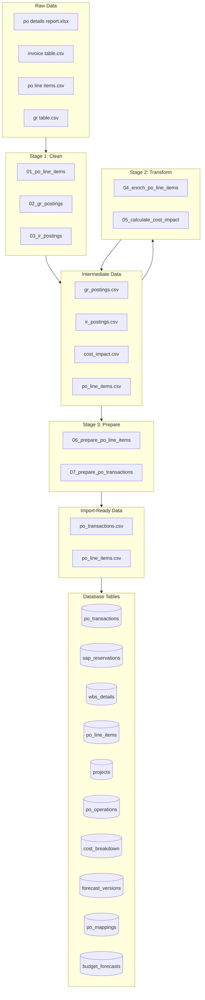
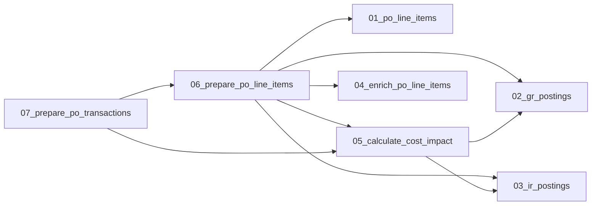

# Pipeline Map

Generated: 2025-11-29T07:08:56.055609

## Data Flow Diagram

## Script Details

| # | Script | Stage | Purpose | Inputs | Outputs |
|---|--------|-------|---------|--------|---------|
| 1 | `01_po_line_items` | stage1_clean | Stage 1: Clean PO Line Items | po line items.csv, po_line_items.csv | po_line_items.csv |
| 2 | `02_gr_postings` | stage1_clean | Stage 1: Clean GR (Goods Receipt) Postings | gr table.csv, po_line_items.csv, gr_postings.csv | po_line_items.csv, gr_postings.csv |
| 3 | `03_ir_postings` | stage1_clean | Stage 1: Clean IR (Invoice Receipt) Postings | invoice table.csv, po_line_items.csv, ir_postings.csv | po_line_items.csv, ir_postings.csv |
| 4 | `04_enrich_po_line_items` | stage2_transform | Stage 2: Enrich PO Line Items | po details report.xlsx, po_line_items.csv | po_line_items.csv |
| 5 | `05_calculate_cost_impact` | stage2_transform | Stage 2: Calculate Cost Impact | po_line_items.csv, gr_postings.csv, ir_postings.csv, cost_impact.csv | po_line_items.csv, gr_postings.csv, ir_postings.csv, cost_impact.csv |
| 6 | `06_prepare_po_line_items` | stage3_prepare | Stage 3: Prepare PO Line Items for Import | po_line_items.csv, cost_impact.csv | po_line_items.csv, cost_impact.csv |
| 7 | `07_prepare_po_transactions` | stage3_prepare | Stage 3: Prepare PO Transactions for Import | cost_impact.csv | cost_impact.csv |
| 8 | `pipeline` | scripts | Data Pipeline Orchestrator | - | - |

## Script Dependencies

## Column Mappings

### PO Line Items (CSV → DB)

| CSV Column | DB Column |
|------------|-----------|
| PO Line ID | `po_line_id` |
| PO Number | `po_number` |
| PO Document Date | `po_creation_date` |
| Plant Code | `plant_code` |
| Location | `location` |
| SL Sub-Business Line Code (BV Lvl 3) | `sub_business_line` |
| PR Number | `pr_number` |
| PR Line | `pr_line` |
| Requester | `requester` |
| Main Vendor ID | `vendor_id` |

*...and 20 more*

## Database Schema

### `po_transactions`

| Column | Type |
|--------|------|
| `id` | uuid |
| `poLineItemId` | uuid |
| `transactionType` | varchar |
| `postingDate` | date |
| `quantity` | numeric |
| `amount` | numeric |
| `costImpactQty` | numeric |
| `costImpactAmount` | numeric |
| `createdAt` | timestamp |
| `updatedAt` | timestamp |

### `sap_reservations`

| Column | Type |
|--------|------|
| `id` | uuid |
| `reservationNumber` | varchar |
| `reservationLineNumber` | varchar |
| `reservationRequirementDate` | date |
| `partNumber` | varchar |
| `description` | text |
| `reservationQty` | numeric |
| `reservationValue` | numeric |
| `reservationStatus` | varchar |
| `poNumber` | varchar |
| `poLineNumber` | integer |
| `wbsNumber` | varchar |
| `assetCode` | varchar |
| `assetSerialNumber` | varchar |
| `requester` | varchar |
| *...* | *3 more* |

### `wbs_details`

| Column | Type |
|--------|------|
| `wbsNumber` | varchar |
| `clientName` | text |
| `subBusinessLine` | text |

### `po_line_items`

| Column | Type |
|--------|------|
| `id` | uuid |
| `poLineId` | varchar |
| `poNumber` | varchar |
| `poCreationDate` | date |
| `plantCode` | varchar |
| `location` | varchar |
| `subBusinessLine` | varchar |
| `prNumber` | varchar |
| `prLine` | integer |
| `requester` | varchar |
| `vendorId` | varchar |
| `vendorName` | varchar |
| `vendorCategory` | varchar |
| `ultimateVendorName` | varchar |
| `lineItemNumber` | integer |
| *...* | *18 more* |

### `projects`

| Column | Type |
|--------|------|
| `id` | uuid |
| `name` | text |
| `subBusinessLine` | text |
| `createdAt` | timestamp |
| `updatedAt` | timestamp |

### `po_operations`

| Column | Type |
|--------|------|
| `id` | uuid |
| `poLineItemId` | uuid |
| `operationType` | varchar |
| `status` | varchar |
| `requestedBy` | varchar |
| `requestedAt` | timestamp |
| `approvedBy` | varchar |
| `approvedAt` | timestamp |
| `completedAt` | timestamp |
| `reason` | text |
| `notes` | text |
| `createdAt` | timestamp |
| `updatedAt` | timestamp |

### `cost_breakdown`

| Column | Type |
|--------|------|
| `id` | uuid |
| `projectId` | uuid |
| `subBusinessLine` | text |
| `costLine` | text |
| `spendType` | text |
| `spendSubCategory` | text |
| `budgetCost` | numeric |
| `createdAt` | timestamp |
| `updatedAt` | timestamp |

### `forecast_versions`

| Column | Type |
|--------|------|
| `id` | uuid |
| `projectId` | uuid |
| `versionNumber` | integer |
| `reasonForChange` | text |
| `createdAt` | timestamp |
| `createdBy` | text |

### `po_mappings`

| Column | Type |
|--------|------|
| `id` | uuid |
| `poLineItemId` | uuid |
| `costBreakdownId` | uuid |
| `mappedAmount` | numeric |
| `mappingNotes` | text |
| `mappedBy` | varchar |
| `mappedAt` | timestamp |
| `createdAt` | timestamp |
| `updatedAt` | timestamp |

### `budget_forecasts`

| Column | Type |
|--------|------|
| `id` | uuid |
| `forecastVersionId` | uuid |
| `costBreakdownId` | uuid |
| `forecastedCost` | numeric |
| `createdAt` | timestamp |
