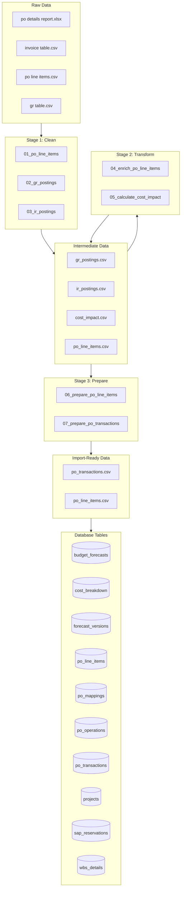
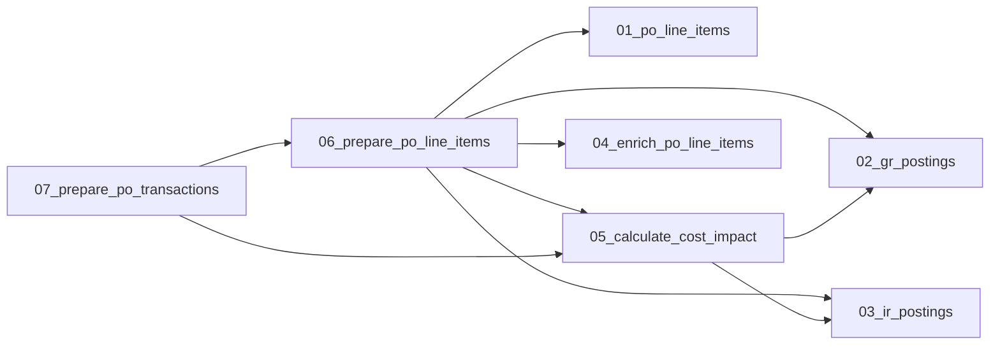

# Pipeline Map

Generated: 2025-11-30T13:56:07.740957+00:00

## Data Flow Diagram

## Script Details

| # | Script | Stage | Purpose | Inputs | Outputs |
|---|--------|-------|---------|--------|---------|
| 1 | `01_po_line_items` | stage1_clean | Stage 1: Clean PO Line Items | po line items.csv, po_line_items.csv | po_line_items.csv |
| 2 | `02_gr_postings` | stage1_clean | Stage 1: Clean GR (Goods Receipt) Postings | gr table.csv, po_line_items.csv, gr_postings.csv | po_line_items.csv, gr_postings.csv |
| 3 | `03_ir_postings` | stage1_clean | Stage 1: Clean IR (Invoice Receipt) Postings | invoice table.csv, po_line_items.csv, ir_postings.csv | po_line_items.csv, ir_postings.csv |
| 4 | `04_enrich_po_line_items` | stage2_transform | Stage 2: Enrich PO Line Items | po details report.xlsx, po_line_items.csv | po_line_items.csv |
| 5 | `05_calculate_cost_impact` | stage2_transform | Stage 2: Calculate Cost Impact | po_line_items.csv, gr_postings.csv, ir_postings.csv, cost_impact.csv | po_line_items.csv, gr_postings.csv, ir_postings.csv, cost_impact.csv |
| 6 | `06_prepare_po_line_items` | stage3_prepare | Stage 3: Prepare PO Line Items for Import | po_line_items.csv, cost_impact.csv | po_line_items.csv, cost_impact.csv |
| 7 | `07_prepare_po_transactions` | stage3_prepare | Stage 3: Prepare PO Transactions for Import | cost_impact.csv | cost_impact.csv |
| 8 | `pipeline` | scripts | Data Pipeline Orchestrator | - | - |

## Script Dependencies

## Column Mappings

### PO Line Items (CSV → DB)

| CSV Column | DB Column |
|------------|-----------|
| PO Line ID | `po_line_id` |
| PO Number | `po_number` |
| PO Document Date | `po_creation_date` |
| Plant Code | `plant_code` |
| Location | `location` |
| SL Sub-Business Line Code (BV Lvl 3) | `sub_business_line` |
| PR Number | `pr_number` |
| PR Line | `pr_line` |
| Requester | `requester` |
| Main Vendor ID | `vendor_id` |

*...and 20 more*

## Database Schema

### `budget_forecasts`

| Column | Type | Constraints |
|--------|------|-------------|
| `id` | uuid | PK |
| `forecastVersionId` | uuid | NOT NULL, FK → forecastVersions.id |
| `costBreakdownId` | uuid | NOT NULL, FK → costBreakdown.id |
| `forecastedCost` | numeric | NOT NULL, DEFAULT |
| `createdAt` | timestamp | - |

### `cost_breakdown`

| Column | Type | Constraints |
|--------|------|-------------|
| `id` | uuid | PK |
| `projectId` | uuid | NOT NULL, FK → projects.id |
| `subBusinessLine` | text | NOT NULL |
| `costLine` | text | NOT NULL |
| `spendType` | text | NOT NULL |
| `spendSubCategory` | text | NOT NULL |
| `budgetCost` | numeric | NOT NULL, DEFAULT |
| `createdAt` | timestamp | - |
| `updatedAt` | timestamp | - |

### `forecast_versions`

| Column | Type | Constraints |
|--------|------|-------------|
| `id` | uuid | PK |
| `projectId` | uuid | NOT NULL, FK → projects.id |
| `versionNumber` | integer | NOT NULL |
| `reasonForChange` | text | NOT NULL |
| `createdAt` | timestamp | - |
| `createdBy` | text | DEFAULT |

### `po_line_items`

| Column | Type | Constraints |
|--------|------|-------------|
| `id` | uuid | PK |
| `poLineId` | varchar | NOT NULL |
| `poNumber` | varchar | NOT NULL |
| `poCreationDate` | date | - |
| `plantCode` | varchar | - |
| `location` | varchar | - |
| `subBusinessLine` | varchar | - |
| `prNumber` | varchar | - |
| `prLine` | integer | - |
| `requester` | varchar | - |
| `vendorId` | varchar | - |
| `vendorName` | varchar | - |
| `vendorCategory` | varchar | - |
| `ultimateVendorName` | varchar | - |
| `lineItemNumber` | integer | NOT NULL |
| *...* | *18 more* | |

### `po_mappings`

| Column | Type | Constraints |
|--------|------|-------------|
| `id` | uuid | PK |
| `poLineItemId` | uuid | NOT NULL, FK → poLineItems.id |
| `costBreakdownId` | uuid | NOT NULL, FK → costBreakdown.id |
| `mappedAmount` | numeric | NOT NULL |
| `mappingNotes` | text | - |
| `mappedBy` | varchar | - |
| `mappedAt` | timestamp | - |
| `createdAt` | timestamp | - |
| `updatedAt` | timestamp | - |

### `po_operations`

| Column | Type | Constraints |
|--------|------|-------------|
| `id` | uuid | PK |
| `poLineItemId` | uuid | NOT NULL, FK → poLineItems.id |
| `operationType` | varchar | NOT NULL |
| `status` | varchar | NOT NULL, DEFAULT |
| `requestedBy` | varchar | NOT NULL |
| `requestedAt` | timestamp | NOT NULL |
| `approvedBy` | varchar | - |
| `approvedAt` | timestamp | - |
| `completedAt` | timestamp | - |
| `reason` | text | NOT NULL |
| `oldValue` | jsonb | - |
| `newValue` | jsonb | - |
| `notes` | text | - |
| `createdAt` | timestamp | - |
| `updatedAt` | timestamp | - |

### `po_transactions`

| Column | Type | Constraints |
|--------|------|-------------|
| `id` | uuid | PK |
| `poLineItemId` | uuid | NOT NULL, FK → poLineItems.id |
| `transactionType` | varchar | NOT NULL |
| `postingDate` | date | NOT NULL |
| `quantity` | numeric | NOT NULL, DEFAULT |
| `amount` | numeric | NOT NULL, DEFAULT |
| `costImpactQty` | numeric | NOT NULL, DEFAULT |
| `costImpactAmount` | numeric | NOT NULL, DEFAULT |
| `createdAt` | timestamp | - |
| `updatedAt` | timestamp | - |

### `projects`

| Column | Type | Constraints |
|--------|------|-------------|
| `id` | uuid | PK |
| `name` | text | NOT NULL |
| `subBusinessLine` | text | NOT NULL |
| `createdAt` | timestamp | - |
| `updatedAt` | timestamp | - |

### `sap_reservations`

| Column | Type | Constraints |
|--------|------|-------------|
| `id` | uuid | PK |
| `reservationNumber` | varchar | NOT NULL |
| `reservationLineNumber` | varchar | NOT NULL |
| `reservationRequirementDate` | date | - |
| `partNumber` | varchar | - |
| `description` | text | - |
| `reservationQty` | numeric | - |
| `reservationValue` | numeric | - |
| `reservationStatus` | varchar | - |
| `poNumber` | varchar | - |
| `poLineNumber` | integer | - |
| `wbsNumber` | varchar | FK → wbsDetails.wbsNumber |
| `assetCode` | varchar | - |
| `assetSerialNumber` | varchar | - |
| `requester` | varchar | - |
| *...* | *3 more* | |

### `wbs_details`

| Column | Type | Constraints |
|--------|------|-------------|
| `wbsNumber` | varchar | PK |
| `clientName` | text | - |
| `subBusinessLine` | text | - |

## Data Profiles

Sample data and types for each CSV file:

### `invoice table.csv`

- **Path**: `data/raw/invoice table.csv`
- **Rows**: 66956

| Column | Type |
|--------|------|
| `PO Line ID` | object |
| `Invoice Posting Date` | object |
| `IR Effective Quantity` | float64 |

### `po line items.csv`

- **Path**: `data/raw/po line items.csv`
- **Rows**: 64538

| Column | Type |
|--------|------|
| `PO Document Date` | object |
| `PO Initial Output Date` | object |
| `SL Sub-Business Line Code (BV Lvl 3)` | object |
| `Plant Code` | int64 |
| `PO Approval Status` | object |
| `PO Account Assignment Category` | object |
| `PO Account Assignment Category Desc` | object |
| `PO WBS Element` | object |
| `PO Number` | int64 |
| `PO Line` | int64 |
| *...* | *21 more* |

**Columns with nulls:**
- `PO Initial Output Date`: 192 nulls
- `PO Account Assignment Category`: 11334 nulls
- `PO Account Assignment Category Desc`: 11334 nulls
- `PO WBS Element`: 40646 nulls
- `PO Material Number`: 49731 nulls
- `PO Valuation Class`: 49731 nulls
- `PO Valuation Class Desc`: 49731 nulls
- `NIS Level 0 Desc`: 13096 nulls
- `PO GTS Status`: 106 nulls
- `PO Current Supplier Promised Date`: 35248 nulls

### `gr table.csv`

- **Path**: `data/raw/gr table.csv`
- **Rows**: 79425

| Column | Type |
|--------|------|
| `PO Line ID` | object |
| `GR Posting Date` | object |
| `GR Effective Quantity` | float64 |

### `gr_postings.csv`

- **Path**: `data/intermediate/gr_postings.csv`
- **Rows**: 55810

| Column | Type |
|--------|------|
| `PO Line ID` | object |
| `GR Posting Date` | object |
| `GR Effective Quantity` | float64 |
| `GR Amount` | float64 |

### `ir_postings.csv`

- **Path**: `data/intermediate/ir_postings.csv`
- **Rows**: 55519

| Column | Type |
|--------|------|
| `PO Line ID` | object |
| `Invoice Posting Date` | object |
| `IR Effective Quantity` | float64 |
| `Invoice Amount` | float64 |

### `cost_impact.csv`

- **Path**: `data/intermediate/cost_impact.csv`
- **Rows**: 109586

| Column | Type |
|--------|------|
| `PO Line ID` | object |
| `Posting Date` | object |
| `Posting Type` | object |
| `Posting Qty` | float64 |
| `Cost Impact Qty` | float64 |
| `Cost Impact Amount` | float64 |

### `po_line_items.csv`

- **Path**: `data/import-ready/po_line_items.csv`
- **Rows**: 57163

| Column | Type |
|--------|------|
| `po_line_id` | object |
| `po_number` | int64 |
| `po_creation_date` | object |
| `plant_code` | int64 |
| `location` | object |
| `sub_business_line` | object |
| `pr_number` | float64 |
| `requester` | object |
| `vendor_id` | object |
| `vendor_name` | object |
| *...* | *18 more* |

**Columns with nulls:**
- `pr_number`: 37584 nulls
- `requester`: 37072 nulls
- `part_number`: 47632 nulls
- `account_assignment_category`: 9047 nulls
- `wbs_number`: 33327 nulls
- `po_gts_status`: 64 nulls

### `po_transactions.csv`

- **Path**: `data/import-ready/po_transactions.csv`
- **Rows**: 109586

| Column | Type |
|--------|------|
| `po_line_id` | object |
| `transaction_type` | object |
| `posting_date` | object |
| `quantity` | float64 |
| `cost_impact_qty` | float64 |
| `cost_impact_amount` | float64 |
| `amount` | float64 |

## Common Errors & Solutions

### KeyError

**Causes:**
- Column doesn't exist in DataFrame
- Previous script in pipeline didn't run
- Column name has different casing or spacing

**Solutions:**
- Check column_mappings.py for correct column names
- Run full pipeline: python3 scripts/pipeline.py
- Use df.columns.tolist() to see actual column names

### MergeError

**Causes:**
- Join columns have different dtypes (int vs str)
- One side has NaN values causing type inference issues

**Solutions:**
- Ensure both join columns are same type: df['col'] = df['col'].astype(str)
- Check for nulls before merge: df['col'].isnull().sum()

### FileNotFoundError

**Causes:**
- Previous pipeline stage didn't run
- Raw data files missing

**Solutions:**
- Run earlier stages first: python3 scripts/pipeline.py --stage1
- Check data/raw/ for source files

### ValueError_date

**Causes:**
- Date column has inconsistent formats
- Non-date values in date column

**Solutions:**
- Use pd.to_datetime with errors='coerce'
- Check for non-date values: df[pd.to_datetime(df['col'], errors='coerce').isna()]

### SchemaValidationError

**Causes:**
- Database schema changed but CSV mapping not updated
- Column dropped in earlier transformation

**Solutions:**
- Compare column_mappings.py with src/schema/*.ts
- Run npm run type-check after schema changes

## Transformation Operations

Key pandas operations used in each script:

### `01_po_line_items`

| Line | Operation | Details |
|------|-----------|---------|
| 103 | column_assign | column: `Location` |
| 114 | column_assign | column: `Expected Delivery Date` |
| 81 | rename | Renames columns |
| 89 | map | Maps values using dictionary or function |
| 94 | map | Maps values using dictionary or function |
| 102 | astype | Converts column types |
| 103 | map | Maps values using dictionary or function |
| 120 | drop | Removes columns or rows |

### `02_gr_postings`

| Line | Operation | Details |
|------|-----------|---------|
| 53 | column_assign | column: `Unit Price` |
| 64 | column_assign | column: `GR Amount` |
| 59 | merge | on: `PO Line ID` |

### `03_ir_postings`

| Line | Operation | Details |
|------|-----------|---------|
| 44 | column_assign | column: `Unit Price` |
| 55 | column_assign | column: `Invoice Amount` |
| 50 | merge | on: `PO Line ID` |

### `04_enrich_po_line_items`

| Line | Operation | Details |
|------|-----------|---------|
| 32 | column_assign | column: `PO Line Item` |
| 33 | column_assign | column: `PO Line ID` |
| 51 | column_assign | column: `PO Line ID` |
| 54 | column_assign | column: `Requester` |
| 64 | column_assign | column: `PR Number` |
| 32 | astype | Converts column types |
| 61 | apply | Applies function to data |
| 62 | apply | Applies function to data |
| 80 | merge | on: `PO Line ID` |
| 89 | astype | Converts column types |

### `05_calculate_cost_impact`

| Line | Operation | Details |
|------|-----------|---------|
| 102 | column_assign | column: `Posting Type` |
| 110 | column_assign | column: `Posting Type` |
| 114 | column_assign | column: `Posting Date` |
| 118 | column_assign | column: `Unit Price` |
| 97 | rename | Renames columns |
| 105 | rename | Renames columns |
| 114 | to_datetime | Converts to datetime |
| 115 | sort_values | Sorts by column values |
| 124 | groupby | by: `PO Line ID` |
| 195 | sort_values | Sorts by column values |

### `06_prepare_po_line_items`

| Line | Operation | Details |
|------|-----------|---------|
| 64 | column_assign | column: `Total Cost Impact Qty` |
| 65 | column_assign | column: `Total Cost Impact Amount` |
| 61 | merge | on: `PO Line ID` |
| 64 | fillna | Fills null values |
| 65 | fillna | Fills null values |
| 87 | drop | cols: `Total Cost Impact Qty, Total Cost Impact Amount` |
| 107 | column_assign | column: `open_po_qty` |
| 109 | column_assign | column: `open_po_value` |
| 115 | column_assign | column: `fmt_po` |
| 117 | column_assign | column: `fmt_po` |

### `07_prepare_po_transactions`

| Line | Operation | Details |
|------|-----------|---------|
| 58 | column_assign | column: `amount` |
| 50 | column_assign | column: `cost_impact_qty` |
| 52 | column_assign | column: `cost_impact_amount` |
| 54 | column_assign | column: `quantity` |
| 44 | boolean_filter | Filters rows based on boolean condition |
